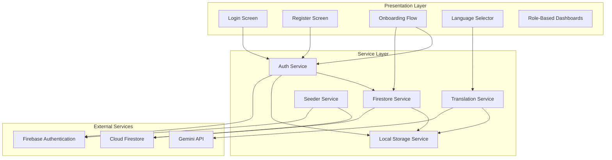
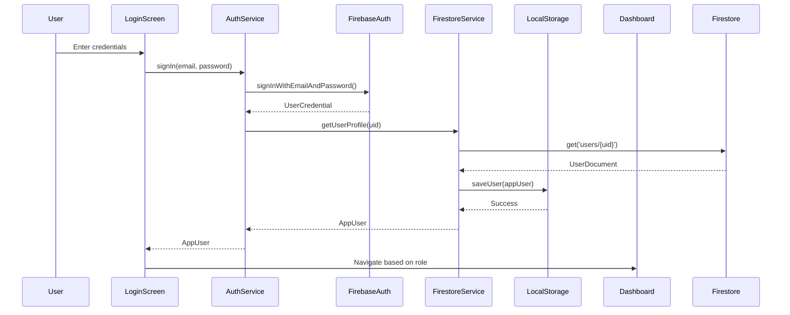
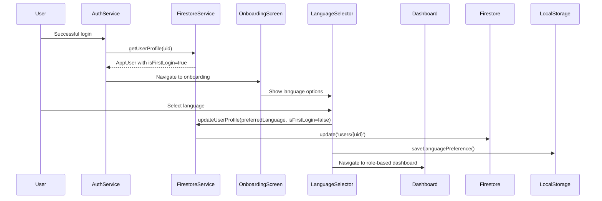
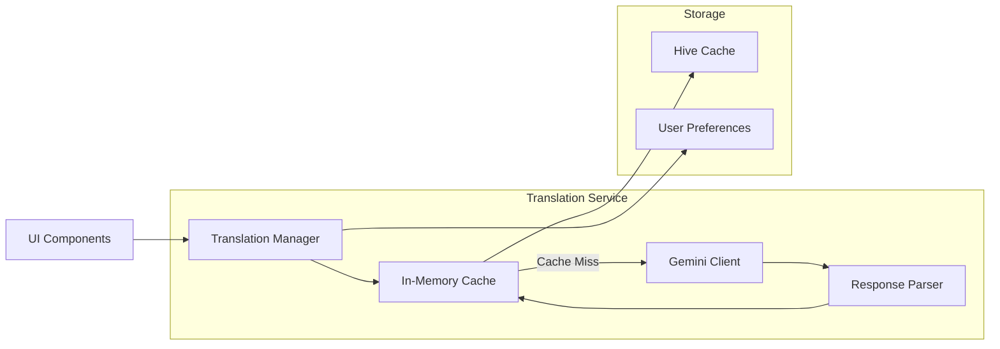
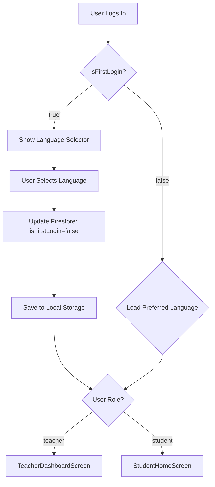
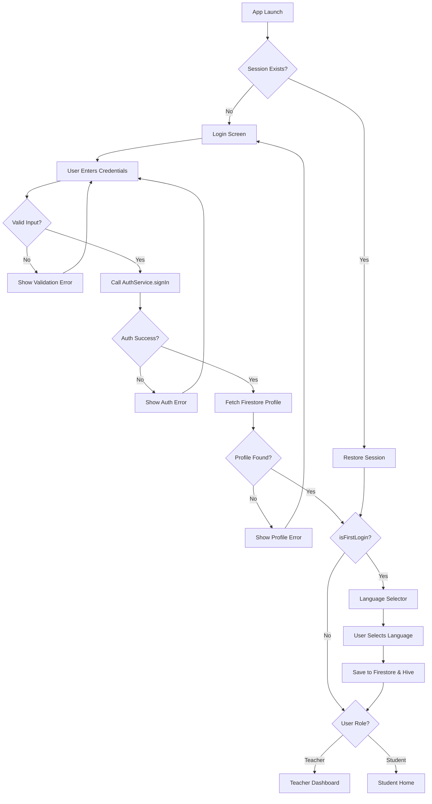
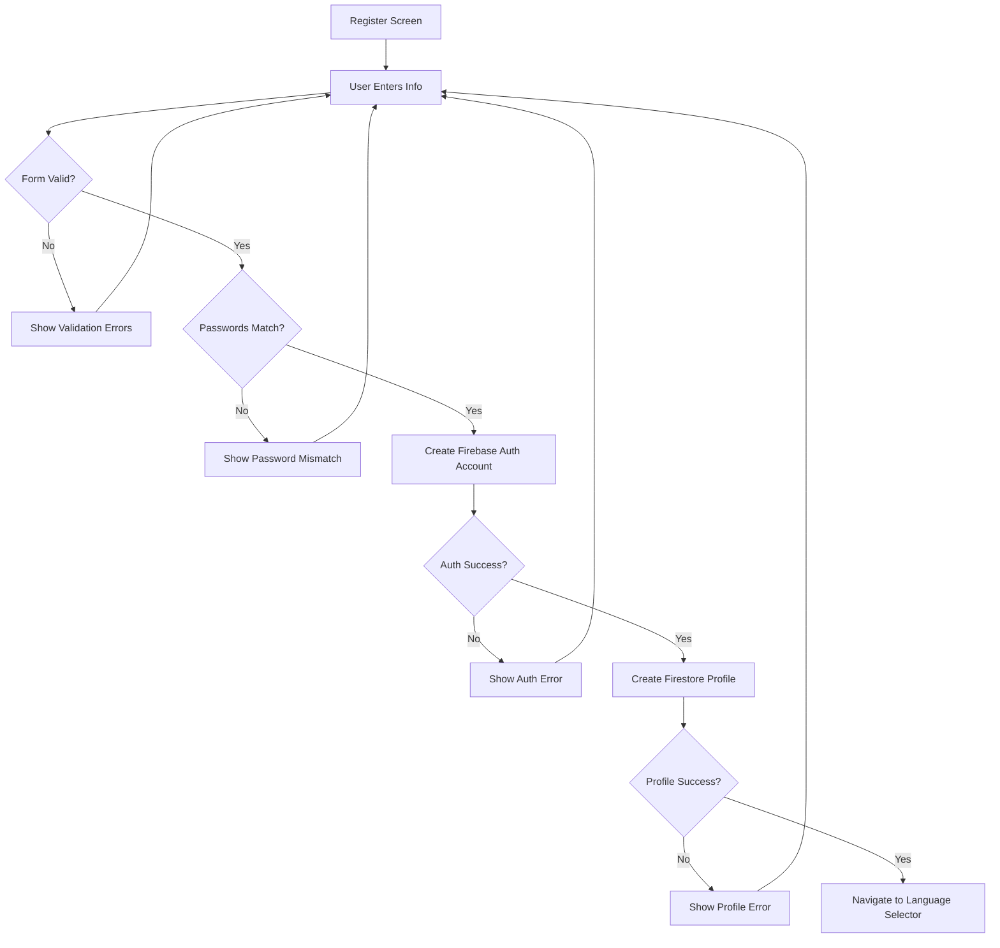
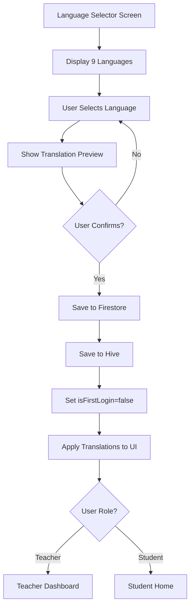
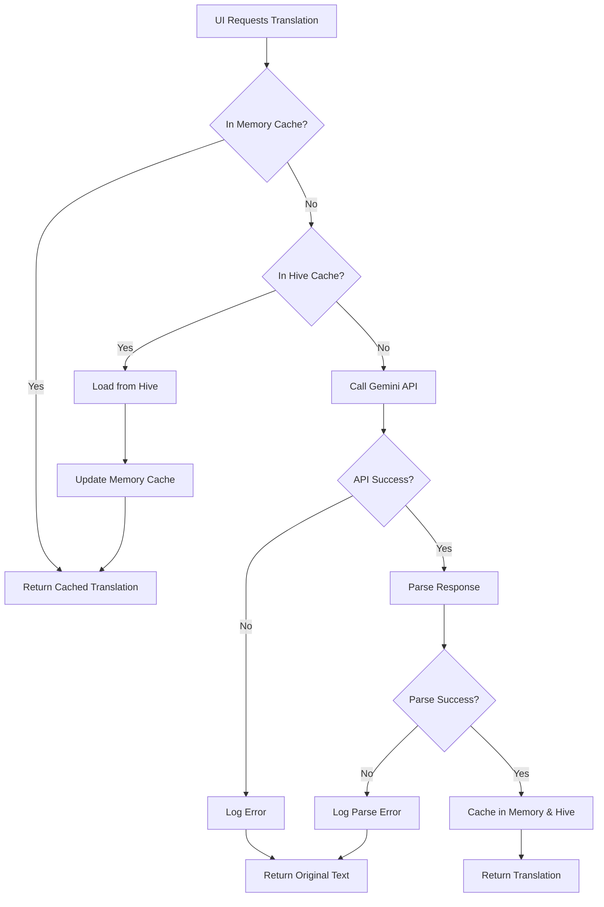

# Design Document: Authentication, Onboarding, and Multi-Language Support

## Overview

This design document specifies the technical architecture for implementing a complete authentication system, first-time user onboarding flow, and multi-language support in the Klaro Flutter app. The system replaces the current demo login with Firebase Authentication, implements role-based navigation, provides language selection during onboarding, and integrates Gemini-powered translation for static UI text across nine Philippine languages.

### Key Design Goals

1. **Secure Authentication**: Leverage Firebase Authentication for email/password sign-in with automatic session persistence
2. **Seamless Onboarding**: Guide first-time users through language selection before accessing the main app
3. **Multi-Language Support**: Enable users to interact with the app in their preferred Philippine language
4. **Role-Based Access**: Direct users to appropriate dashboards based on their role (teacher/student)
5. **Offline-First**: Cache translations and user preferences locally for offline access
6. **Developer Experience**: Provide test accounts and seeding utilities for rapid development

### Architecture Principles

- **Separation of Concerns**: Authentication, user data, and translation services are independent modules
- **Firebase-First**: Use Firebase Authentication for identity and Firestore for user profiles
- **Local-First**: Hive storage provides offline access and reduces Firestore reads
- **Fail-Safe**: Graceful degradation to English when translations fail
- **Stateless Translation**: Translation service operates independently of UI state

## Architecture

### High-Level System Architecture



### Authentication Flow



### Onboarding Flow



### Translation Architecture



## Components and Interfaces

### 1. Enhanced Auth Service

**Purpose**: Manages Firebase Authentication and integrates with Firestore for user profiles

**Key Methods**:

```dart
class AuthService {
  // Sign in with email/password (enhanced to fetch Firestore profile)
  Future<AppUser?> signIn(String email, String password);

  // Sign out and clear session
  Future<void> signOut();

  // Get current authenticated user
  Future<AppUser?> getCurrentUser();

  // Stream of auth state changes
  Stream<User?> get authStateChanges;

  // Map Firebase errors to user-friendly messages
  String _handleAuthError(FirebaseAuthException e);

  // Check if user needs onboarding (isFirstLogin flag)
  Future<bool> needsOnboarding(String uid);
}
```

**Integration Points**:

- Firebase Authentication SDK for identity management
- Firestore Service for user profile data
- Local Storage Service for offline session persistence
- Existing demo account fallback for quick testing

**Error Handling**:

- Maps Firebase error codes to user-friendly messages
- Handles network failures gracefully
- Falls back to demo accounts when Firebase is unavailable

### 2. Firestore Service

**Purpose**: Manages user profile data in Cloud Firestore

**Data Structure**:

```dart
// Firestore collection: users/{uid}
class UserProfile {
  String uid;              // Firebase Auth UID
  String email;            // User email
  String role;             // "teacher" or "student"
  bool isFirstLogin;       // true for new users
  String preferredLanguage; // Language code (e.g., "en", "tl")
  DateTime createdAt;      // Account creation timestamp
  DateTime updatedAt;      // Last profile update
}
```

**Key Methods**:

```dart
class FirestoreService {
  // Create user profile after registration
  Future<void> createUserProfile(AppUser user);

  // Get user profile by UID
  Future<UserProfile?> getUserProfile(String uid);

  // Update user profile fields
  Future<void> updateUserProfile(String uid, Map<String, dynamic> updates);

  // Update language preference
  Future<void> updateLanguagePreference(String uid, String languageCode);

  // Mark first login as complete
  Future<void> completeFirstLogin(String uid);
}
```

**Firestore Security Rules**:

```javascript
rules_version = '2';
service cloud.firestore {
  match /databases/{database}/documents {
    match /users/{userId} {
      // Users can read and write their own profile
      allow read, write: if request.auth != null && request.auth.uid == userId;
    }
  }
}
```

### 3. Seeder Service

**Purpose**: Automatically creates test accounts in Firebase for development

**Key Methods**:

```dart
class SeederService {
  // Seed all test accounts
  Future<void> seedTestAccounts();

  // Create individual test account
  Future<void> _createTestAccount(String email, String password, UserRole role);

  // Check if account already exists
  Future<bool> _accountExists(String email);

  // Log seeding results
  void _logSeedingResult(String email, bool success, String? error);
}
```

**Test Accounts**:

- Teacher: `teacher@test.com` / `password123`
- Student: `student@test.com` / `password123`

**Execution Strategy**:

- Runs automatically on app startup in development mode
- Checks for existing accounts before creation
- Logs success/failure for debugging
- Creates both Firebase Auth accounts and Firestore profiles
- Sets isFirstLogin to true for newly created accounts to trigger onboarding flow

### 4. Translation Service

**Purpose**: Provides runtime translation of static UI text using Gemini API

**Key Methods**:

```dart
class TranslationService {
  // Initialize service and load user's preferred language
  Future<void> initialize();

  // Translate a single text string
  Future<String> translate(String text, String targetLanguage);

  // Translate multiple strings in batch
  Future<Map<String, String>> translateBatch(List<String> texts, String targetLanguage);

  // Get cached translation
  String? getCachedTranslation(String text, String language);

  // Save translation to cache
  Future<void> cacheTranslation(String text, String language, String translation);

  // Change user's preferred language
  Future<void> setPreferredLanguage(String languageCode);

  // Get current preferred language
  String getPreferredLanguage();
}
```

**Translation Request Format**:

```dart
class TranslationRequest {
  final String sourceText;
  final String targetLanguageCode;
  final String? context; // Optional context for better translation

  Map<String, dynamic> toJson() => {
    'sourceText': sourceText,
    'targetLanguage': targetLanguageCode,
    if (context != null) 'context': context,
  };
}
```

**Translation Response Format**:

```dart
class TranslationResponse {
  final String translatedText;
  final String languageCode;
  final bool fromCache;

  factory TranslationResponse.fromJson(Map<String, dynamic> json) {
    return TranslationResponse(
      translatedText: json['translatedText'] as String,
      languageCode: json['languageCode'] as String,
      fromCache: json['fromCache'] as bool? ?? false,
    );
  }
}
```

**Gemini Prompt Template**:

```dart
String _buildTranslationPrompt(String text, String targetLanguage) {
  return '''
You are a professional translator for Filipino educational content.
Translate the following English text to $targetLanguage.

Rules:
- Maintain the original meaning and tone
- Use natural, conversational language appropriate for Grade 7 students
- Keep technical terms in English if commonly used that way
- Preserve any placeholders like {name} or {count}

Text to translate: "$text"

Respond with ONLY the translated text, no explanations or additional text.
''';
}
```

**Caching Strategy**:

1. **In-Memory Cache**: First-level cache for current session (Map<String, String>)
2. **Hive Cache**: Persistent cache across app restarts
3. **Cache Key Format**: `{languageCode}:{sourceText}`
4. **Cache Invalidation**: Manual clear or version-based invalidation

### 5. Language Selector Component

**Purpose**: UI component for selecting preferred language during onboarding or in settings

**Supported Languages**:

```dart
enum SupportedLanguage {
  english('en', 'English'),
  tagalog('tl', 'Tagalog'),
  cebuano('ceb', 'Cebuano'),
  ilocano('ilo', 'Ilocano'),
  hiligaynon('hil', 'Hiligaynon'),
  waray('war', 'Waray'),
  kapampangan('pam', 'Kapampangan'),
  bikol('bik', 'Bikol'),
  pangasinan('pan', 'Pangasinan');

  const SupportedLanguage(this.code, this.displayName);
  final String code;
  final String displayName;
}
```

**UI Design**:

- Grid or list layout showing all 9 languages
- Visual indicator for currently selected language
- Immediate preview of translation when language is selected
- Confirmation button to save preference

### 6. Onboarding Flow Manager

**Purpose**: Orchestrates the first-time user experience

**Flow Logic**:

```dart
class OnboardingFlowManager {
  // Check if user needs onboarding
  Future<bool> shouldShowOnboarding(AppUser user);

  // Navigate to appropriate screen based on onboarding status
  Future<void> navigateAfterLogin(AppUser user, BuildContext context);

  // Complete onboarding and navigate to dashboard
  Future<void> completeOnboarding(AppUser user, String selectedLanguage);
}
```

**Decision Tree**:



## Data Models

### AppUser Model (Enhanced)

```dart
class AppUser {
  final String uid;
  final String name;
  final String email;
  final UserRole role;
  final bool isFirstLogin;
  final String preferredLanguage;
  final DateTime? createdAt;

  AppUser({
    required this.uid,
    required this.name,
    required this.email,
    required this.role,
    this.isFirstLogin = true,
    this.preferredLanguage = 'en',
    this.createdAt,
  });

  bool get isStudent => role == UserRole.student;
  bool get isTeacher => role == UserRole.teacher;
  bool get needsOnboarding => isFirstLogin;

  Map<String, dynamic> toMap() {
    return {
      'uid': uid,
      'name': name,
      'email': email,
      'role': role == UserRole.student ? 'student' : 'teacher',
      'isFirstLogin': isFirstLogin,
      'preferredLanguage': preferredLanguage,
      'createdAt': createdAt?.toIso8601String(),
    };
  }

  factory AppUser.fromMap(Map<dynamic, dynamic> map) {
    return AppUser(
      uid: map['uid'] ?? '',
      name: map['name'] ?? '',
      email: map['email'] ?? '',
      role: map['role'] == 'teacher' ? UserRole.teacher : UserRole.student,
      isFirstLogin: map['isFirstLogin'] ?? true,
      preferredLanguage: map['preferredLanguage'] ?? 'en',
      createdAt: map['createdAt'] != null
          ? DateTime.parse(map['createdAt'])
          : null,
    );
  }

  // Create a copy with updated fields
  AppUser copyWith({
    String? name,
    bool? isFirstLogin,
    String? preferredLanguage,
  }) {
    return AppUser(
      uid: uid,
      name: name ?? this.name,
      email: email,
      role: role,
      isFirstLogin: isFirstLogin ?? this.isFirstLogin,
      preferredLanguage: preferredLanguage ?? this.preferredLanguage,
      createdAt: createdAt,
    );
  }
}
```

### Translation Cache Entry

```dart
class TranslationCacheEntry {
  final String sourceText;
  final String targetLanguage;
  final String translatedText;
  final DateTime cachedAt;

  TranslationCacheEntry({
    required this.sourceText,
    required this.targetLanguage,
    required this.translatedText,
    required this.cachedAt,
  });

  String get cacheKey => '$targetLanguage:$sourceText';

  bool isExpired(Duration maxAge) {
    return DateTime.now().difference(cachedAt) > maxAge;
  }

  Map<String, dynamic> toMap() {
    return {
      'sourceText': sourceText,
      'targetLanguage': targetLanguage,
      'translatedText': translatedText,
      'cachedAt': cachedAt.toIso8601String(),
    };
  }

  factory TranslationCacheEntry.fromMap(Map<dynamic, dynamic> map) {
    return TranslationCacheEntry(
      sourceText: map['sourceText'] ?? '',
      targetLanguage: map['targetLanguage'] ?? '',
      translatedText: map['translatedText'] ?? '',
      cachedAt: DateTime.parse(map['cachedAt']),
    );
  }
}
```

### Language Preference Model

```dart
class LanguagePreference {
  final String languageCode;
  final String languageName;
  final DateTime selectedAt;
  final bool isDefault;

  LanguagePreference({
    required this.languageCode,
    required this.languageName,
    required this.selectedAt,
    this.isDefault = false,
  });

  Map<String, dynamic> toMap() {
    return {
      'languageCode': languageCode,
      'languageName': languageName,
      'selectedAt': selectedAt.toIso8601String(),
      'isDefault': isDefault,
    };
  }

  factory LanguagePreference.fromMap(Map<dynamic, dynamic> map) {
    return LanguagePreference(
      languageCode: map['languageCode'] ?? 'en',
      languageName: map['languageName'] ?? 'English',
      selectedAt: DateTime.parse(map['selectedAt']),
      isDefault: map['isDefault'] ?? false,
    );
  }
}
```

## Error Handling

### Authentication Errors

**Firebase Error Code Mapping**:

```dart
class AuthErrorHandler {
  static String getErrorMessage(FirebaseAuthException e) {
    switch (e.code) {
      case 'user-not-found':
        return 'No account found with this email. Please check your email or create a new account.';
      case 'wrong-password':
        return 'Incorrect password. Please try again or reset your password.';
      case 'email-already-in-use':
        return 'An account already exists with this email. Please sign in instead.';
      case 'weak-password':
        return 'Password is too weak. Use at least 6 characters with a mix of letters and numbers.';
      case 'invalid-email':
        return 'Please enter a valid email address.';
      case 'user-disabled':
        return 'This account has been disabled. Please contact support.';
      case 'network-request-failed':
        return 'Network error. Please check your internet connection and try again.';
      case 'too-many-requests':
        return 'Too many failed attempts. Please wait a few minutes and try again.';
      default:
        return 'Authentication failed: ${e.message ?? "Unknown error"}. Please try again.';
    }
  }
}
```

### Translation Errors

**Error Handling Strategy**:

```dart
class TranslationErrorHandler {
  // Handle Gemini API errors
  static String handleGeminiError(dynamic error) {
    if (error is GeminiServiceException) {
      return error.message;
    }
    if (error.toString().contains('quota')) {
      return 'Translation quota exceeded. Using English for now.';
    }
    if (error.toString().contains('network')) {
      return 'Network error. Using cached translations.';
    }
    return 'Translation unavailable. Showing original text.';
  }

  // Fallback to original text
  static String getFallbackText(String originalText) {
    return originalText; // Always show something to the user
  }

  // Log translation errors for debugging
  static void logTranslationError(String text, String language, dynamic error) {
    debugPrint('Translation failed: $text -> $language');
    debugPrint('Error: $error');
  }
}
```

### Firestore Errors

**Error Handling**:

```dart
class FirestoreErrorHandler {
  static String getErrorMessage(FirebaseException e) {
    switch (e.code) {
      case 'permission-denied':
        return 'Access denied. Please sign in again.';
      case 'not-found':
        return 'User profile not found. Please contact support.';
      case 'unavailable':
        return 'Service temporarily unavailable. Please try again.';
      case 'deadline-exceeded':
        return 'Request timed out. Please check your connection.';
      default:
        return 'An error occurred: ${e.message}';
    }
  }
}
```

## Testing Strategy

### Unit Testing

**Authentication Service Tests**:

- Test successful sign-in with valid credentials
- Test sign-in failure with invalid credentials
- Test sign-up with valid data
- Test sign-up with duplicate email
- Test error message mapping for all Firebase error codes
- Test session persistence after app restart
- Test sign-out clears local session

**Firestore Service Tests**:

- Test user profile creation
- Test user profile retrieval
- Test user profile updates
- Test language preference updates
- Test first login flag updates
- Test error handling for missing documents

**Translation Service Tests**:

- Test translation request formatting
- Test translation response parsing
- Test cache hit returns cached translation
- Test cache miss calls Gemini API
- Test fallback to original text on error
- Test batch translation
- Test language preference persistence

**Seeder Service Tests**:

- Test account creation when accounts don't exist
- Test skipping creation when accounts already exist
- Test error handling for Firebase failures
- Test logging of seeding results

### Integration Testing

**Authentication Flow Tests**:

- Test complete sign-in flow from UI to dashboard
- Test role-based navigation (teacher vs student)
- Test onboarding flow for first-time users
- Test skipping onboarding for returning users
- Test session restoration on app restart

**Translation Flow Tests**:

- Test language selection during onboarding
- Test immediate translation application after selection
- Test translation persistence across app restarts
- Test translation cache performance
- Test fallback to English on translation failure

**End-to-End Tests**:

- Test new user registration → onboarding → language selection → dashboard
- Test returning user login → skip onboarding → dashboard
- Test language change in settings → immediate UI update
- Test offline mode with cached translations

### Property-Based Testing Applicability

**Assessment**: Property-based testing (PBT) is **partially applicable** to this feature.

**PBT IS appropriate for**:

- Translation service parser/printer (round-trip property)
- Cache key generation (consistency property)
- User profile serialization/deserialization (round-trip property)

**PBT is NOT appropriate for**:

- Firebase Authentication integration (external service)
- Firestore operations (external service, infrastructure)
- UI rendering and navigation (visual/interaction testing)
- Gemini API calls (external service with non-deterministic responses)

**Testing Approach**:

- Use **unit tests** with mocks for Firebase and Gemini interactions
- Use **integration tests** for end-to-end flows with real Firebase (test project)
- Use **property-based tests** only for pure data transformation logic (see Correctness Properties section below)

## Correctness Properties

_A property is a characteristic or behavior that should hold true across all valid executions of a system—essentially, a formal statement about what the system should do. Properties serve as the bridge between human-readable specifications and machine-verifiable correctness guarantees._

### Property Reflection

After analyzing all acceptance criteria, I identified the following properties suitable for property-based testing. Many criteria test external services (Firebase Auth, Firestore, Gemini API) or UI rendering, which are better suited for integration or example-based tests.

**Redundancy Analysis**:

- Properties 2.4 and 5.2/5.3 test the same navigation logic - consolidated into Property 1
- Properties 2.5 and 2.10 test the same error display logic - consolidated into Property 2
- Properties 4.2, 4.3, 4.4, 4.5, 4.6 all test user document structure - consolidated into Property 3
- Properties 6.2 and 6.3 test complementary onboarding navigation - kept separate as they test different conditions
- Properties 8.5 and 8.6 test cache behavior - consolidated into Property 7
- Properties 9.1 and 9.2 test data structure formats - consolidated into Property 8
- Properties 12.2 and 12.6 test local storage persistence - consolidated into Property 11

### Property 1: Role-Based Navigation Correctness

_For any_ authenticated user with a valid role (teacher or student), the system SHALL navigate to the dashboard corresponding to that role (teacher dashboard for teachers, student home for students).

**Validates: Requirements 2.4, 5.2, 5.3**

### Property 2: Error Message Display Completeness

_For any_ authentication or registration error message returned by the Auth_System, the UI SHALL display that error message to the user without modification or loss.

**Validates: Requirements 2.5, 2.10**

### Property 3: User Document Structure Completeness

_For any_ user being persisted to Firestore, the user document SHALL contain all required fields (uid, email, role, isFirstLogin, preferredLanguage) with valid values (uid matches Firebase Auth UID, role is "teacher" or "student", isFirstLogin is boolean, preferredLanguage is a valid language code).

**Validates: Requirements 4.2, 4.3, 4.4, 4.5, 4.6**

### Property 4: Password Validation Consistency

_For any_ pair of password strings (password and confirmation), the validation logic SHALL correctly determine whether they match (return true if identical, false otherwise).

**Validates: Requirements 2.7**

### Property 5: Seeder Idempotence

_For any_ number of seeder executions, test accounts SHALL be created exactly once (running the seeder multiple times SHALL NOT create duplicate accounts).

**Validates: Requirements 3.4, 3.5**

### Property 6: Onboarding Navigation Logic

_For any_ user with isFirstLogin=true, the system SHALL navigate to the Language_Selector screen before the dashboard; for any user with isFirstLogin=false, the system SHALL navigate directly to the role-based dashboard.

**Validates: Requirements 6.2, 6.3**

### Property 7: Translation Cache Efficiency

_For any_ translation request, if the translation has been previously requested and cached, the Translation_Service SHALL return the cached translation without calling the Gemini API; if not cached, it SHALL call the Gemini API and cache the result for future requests.

**Validates: Requirements 8.5, 8.6**

### Property 8: Translation Request/Response Format Validity

_For any_ translation request or response, the data structure SHALL contain all required fields (sourceText and targetLanguageCode for requests; translatedText and languageCode for responses) with non-empty values.

**Validates: Requirements 9.1, 9.2**

### Property 9: Translation Round-Trip Preservation

_For any_ valid translation response, parsing the response then formatting it then parsing again SHALL produce an equivalent translation object (parse ∘ format ∘ parse = parse).

**Validates: Requirements 9.6**

### Property 10: Error Code Mapping Completeness

_For any_ Firebase Authentication error code, the Auth_System SHALL map it to a non-empty, user-friendly error message (no error code SHALL result in an empty or null message).

**Validates: Requirements 1.3, 10.1, 10.3**

### Property 11: Language Preference Persistence

_For any_ language selection, the Translation_Service SHALL persist the language code to both Firestore and local Hive storage, ensuring the preference is available offline and synchronized across devices.

**Validates: Requirements 7.5, 12.2, 12.6**

### Property 12: Translation Error Fallback

_For any_ translation error (network failure, API error, parsing failure), the Translation_Service SHALL fall back to displaying the original English text without crashing or showing empty content.

**Validates: Requirements 8.8, 9.4**

### Property 13: Firestore Error Handling

_For any_ Firestore error during user profile retrieval, the Auth_System SHALL display an error message and remain on the Login_Screen without navigating away or crashing.

**Validates: Requirements 5.4**

## Testing Strategy

### Overview

This feature requires a **dual testing approach** combining property-based tests for pure logic with integration tests for external service interactions. The majority of functionality involves Firebase Authentication, Firestore, and Gemini API, which are external services not suitable for property-based testing.

### Property-Based Testing

**Library**: Use `flutter_test` with a property-based testing library like `test_api` with custom generators, or consider `fast_check` patterns adapted to Dart.

**Configuration**:

- Minimum **100 iterations** per property test
- Each property test MUST reference its design document property
- Tag format: `// Feature: authentication-onboarding-multilang, Property {number}: {property_text}`

**Properties to Implement**:

1. **Property 1: Role-Based Navigation Correctness**
   - Generator: Random users with roles (teacher/student)
   - Assertion: Navigation destination matches role
   - Tag: `// Feature: authentication-onboarding-multilang, Property 1: Role-Based Navigation Correctness`

2. **Property 2: Error Message Display Completeness**
   - Generator: Random error messages (non-empty strings)
   - Assertion: Error message displayed in UI without modification
   - Tag: `// Feature: authentication-onboarding-multilang, Property 2: Error Message Display Completeness`

3. **Property 3: User Document Structure Completeness**
   - Generator: Random users with various field values
   - Assertion: All required fields present with valid values
   - Tag: `// Feature: authentication-onboarding-multilang, Property 3: User Document Structure Completeness`

4. **Property 4: Password Validation Consistency**
   - Generator: Random password pairs (matching and non-matching)
   - Assertion: Validation returns true for matches, false for non-matches
   - Tag: `// Feature: authentication-onboarding-multilang, Property 4: Password Validation Consistency`

5. **Property 5: Seeder Idempotence**
   - Generator: Random number of seeder executions (1-10)
   - Assertion: Accounts created exactly once
   - Tag: `// Feature: authentication-onboarding-multilang, Property 5: Seeder Idempotence`

6. **Property 6: Onboarding Navigation Logic**
   - Generator: Random users with isFirstLogin true/false
   - Assertion: Navigation matches isFirstLogin state
   - Tag: `// Feature: authentication-onboarding-multilang, Property 6: Onboarding Navigation Logic`

7. **Property 7: Translation Cache Efficiency**
   - Generator: Random translation requests (some repeated)
   - Assertion: Cached translations don't call API, new translations do
   - Tag: `// Feature: authentication-onboarding-multilang, Property 7: Translation Cache Efficiency`

8. **Property 8: Translation Request/Response Format Validity**
   - Generator: Random translation requests and responses
   - Assertion: All required fields present and non-empty
   - Tag: `// Feature: authentication-onboarding-multilang, Property 8: Translation Request/Response Format Validity`

9. **Property 9: Translation Round-Trip Preservation**
   - Generator: Random translation responses
   - Assertion: parse(format(parse(response))) == parse(response)
   - Tag: `// Feature: authentication-onboarding-multilang, Property 9: Translation Round-Trip Preservation`

10. **Property 10: Error Code Mapping Completeness**
    - Generator: Random Firebase error codes
    - Assertion: All map to non-empty messages
    - Tag: `// Feature: authentication-onboarding-multilang, Property 10: Error Code Mapping Completeness`

11. **Property 11: Language Preference Persistence**
    - Generator: Random language codes
    - Assertion: Language saved to both Firestore and Hive
    - Tag: `// Feature: authentication-onboarding-multilang, Property 11: Language Preference Persistence`

12. **Property 12: Translation Error Fallback**
    - Generator: Random translation errors
    - Assertion: Original text displayed, no crash
    - Tag: `// Feature: authentication-onboarding-multilang, Property 12: Translation Error Fallback`

13. **Property 13: Firestore Error Handling**
    - Generator: Random Firestore errors
    - Assertion: Error displayed, stays on login screen
    - Tag: `// Feature: authentication-onboarding-multilang, Property 13: Firestore Error Handling`

### Unit Testing

**Focus**: Test pure logic and data transformations with mocks for external services.

**Test Coverage**:

1. **AuthService**:
   - Error message mapping (all Firebase error codes)
   - Demo account credential matching
   - User serialization/deserialization
   - Session state management

2. **FirestoreService**:
   - User profile data structure validation
   - Field default values
   - Update operations (with mocked Firestore)

3. **TranslationService**:
   - Cache key generation
   - Request/response parsing
   - Fallback logic
   - Language preference loading priority

4. **SeederService**:
   - Account existence checking
   - Logging behavior
   - Error handling

5. **Data Models**:
   - AppUser serialization/deserialization
   - TranslationCacheEntry serialization
   - LanguagePreference serialization
   - copyWith methods

### Integration Testing

**Focus**: Test interactions with real Firebase services and Gemini API using test projects.

**Test Coverage**:

1. **Authentication Flow**:
   - Sign in with valid credentials → session created
   - Sign in with invalid credentials → error displayed
   - Sign up → Firebase Auth account + Firestore document created
   - Sign out → session cleared
   - App restart → session restored

2. **Onboarding Flow**:
   - First-time user → language selector shown
   - Returning user → skip to dashboard
   - Language selection → Firestore and Hive updated
   - Role-based navigation after onboarding

3. **Translation Flow**:
   - Language selection → Gemini API called
   - Translation caching → subsequent requests use cache
   - Translation error → fallback to English
   - App restart → language preference restored

4. **Seeder Service**:
   - First run → accounts created
   - Second run → accounts skipped (idempotence)
   - Firebase Auth and Firestore both populated

### Widget Testing

**Focus**: Test UI components and user interactions.

**Test Coverage**:

1. **Login Screen**:
   - Email and password fields present
   - Login button triggers authentication
   - Error messages displayed correctly
   - Navigation to register screen

2. **Register Screen**:
   - All input fields present
   - Password confirmation validation
   - Role selection works
   - Error messages displayed correctly

3. **Language Selector**:
   - All 9 languages displayed
   - Language selection updates UI
   - Confirmation button enabled after selection

4. **Onboarding Flow**:
   - Language selector shown for first-time users
   - Skip onboarding for returning users
   - Navigation after language selection

### End-to-End Testing

**Focus**: Test complete user journeys from start to finish.

**Test Scenarios**:

1. **New User Journey**:
   - Open app → login screen
   - Register new account → account created
   - Language selector shown → select Tagalog
   - Navigate to dashboard → Tagalog UI displayed

2. **Returning User Journey**:
   - Open app → session restored
   - Skip onboarding → direct to dashboard
   - UI in previously selected language

3. **Language Change Journey**:
   - Open settings → change language to Cebuano
   - UI updates immediately
   - Close and reopen app → Cebuano persisted

4. **Offline Mode Journey**:
   - Open app offline → cached translations displayed
   - Attempt new translation → fallback to English
   - Go online → translations work again

### Test Data Management

**Test Firebase Project**:

- Use separate Firebase project for testing
- Configure test project in `firebase_options_test.dart`
- Use Firebase Emulator Suite for local testing

**Test Accounts**:

- Create dedicated test accounts (not production accounts)
- Use seeder service to populate test data
- Clean up test data after test runs

**Mock Data**:

- Mock Gemini API responses for translation tests
- Mock Firestore responses for offline tests
- Use test fixtures for consistent test data

### Performance Testing

**Translation Performance**:

- Measure cache hit rate (target: >80% for repeated translations)
- Measure translation latency (target: <500ms for cached, <2s for API)
- Test with 100+ translations to verify cache efficiency

**Authentication Performance**:

- Measure login time (target: <2s)
- Measure session restoration time (target: <500ms)
- Test with slow network conditions

### Accessibility Testing

**Manual Testing**:

- Test with TalkBack (Android screen reader)
- Verify all UI elements have semantic labels
- Test navigation with keyboard only
- Verify color contrast meets WCAG AA standards

**Note**: Automated accessibility testing is limited in Flutter. Manual testing with assistive technologies is required for full WCAG compliance validation.

### Security Testing

**Authentication Security**:

- Verify passwords are not logged or stored in plain text
- Test session timeout behavior
- Verify Firebase security rules prevent unauthorized access
- Test for SQL injection in Firestore queries (not applicable, but verify input sanitization)

**Data Privacy**:

- Verify user data is only accessible to the authenticated user
- Test that language preferences are private
- Verify no sensitive data in error messages

### Continuous Integration

**CI Pipeline**:

1. Run unit tests (fast, no external dependencies)
2. Run property-based tests (100 iterations each)
3. Run widget tests
4. Run integration tests (with Firebase Emulator)
5. Generate code coverage report (target: >80%)

**Test Execution Time**:

- Unit tests: <1 minute
- Property-based tests: <5 minutes
- Widget tests: <2 minutes
- Integration tests: <10 minutes
- Total: <20 minutes

## UI/UX Flow Diagrams

### Login Screen Flow



### Registration Screen Flow



### Language Selection Flow



### Translation Service Flow



## Implementation Notes

### Firebase Configuration

**Android Setup**:

1. Ensure `android/app/google-services.json` is present and up-to-date
2. Verify Firebase project has Authentication and Firestore enabled
3. Enable Email/Password authentication in Firebase Console
4. Configure Firestore security rules (see Firestore Service section)

**Firebase AI Logic**:

1. Enable Firebase AI Logic in Firebase Console
2. Verify Gemini model (`gemini-2.5-flash-lite`) is available
3. Configure API quotas and billing if needed

### Local Storage Configuration

**Hive Boxes**:

- `users`: User profile data (existing)
- `word_cache`: Word explanations (existing)
- `translation_cache`: New box for translation caching
- `language_preference`: New box for language preferences

**Initialization**:

```dart
await Hive.initFlutter();
await Hive.openBox(AppConstants.userBox);
await Hive.openBox(AppConstants.cacheBox);
await Hive.openBox('translation_cache');
await Hive.openBox('language_preference');
```

### Translation Implementation Strategy

**Phase 1: Core Infrastructure**

1. Implement TranslationService with Gemini integration
2. Implement caching layer (memory + Hive)
3. Implement language preference persistence

**Phase 2: UI Integration**

1. Create translatable text wrapper widget
2. Implement Language Selector screen
3. Add translation to one complete screen (e.g., Login Screen)

**Phase 3: Expansion**

1. Add translations to remaining screens
2. Optimize cache performance
3. Add translation management tools

**Translation Wrapper Example**:

```dart
class TranslatableText extends StatelessWidget {
  final String text;
  final TextStyle? style;

  const TranslatableText(this.text, {this.style});

  @override
  Widget build(BuildContext context) {
    final translationService = context.read<TranslationService>();
    return FutureBuilder<String>(
      future: translationService.translate(text, translationService.getPreferredLanguage()),
      builder: (context, snapshot) {
        return Text(
          snapshot.data ?? text, // Fallback to original
          style: style,
        );
      },
    );
  }
}
```

### Development Workflow

**Step 1: Authentication Enhancement**

1. Update AppUser model with new fields
2. Implement FirestoreService
3. Update AuthService to integrate with Firestore
4. Implement error handling
5. Write unit tests

**Step 2: Seeder Service**

1. Implement SeederService
2. Add development mode detection
3. Integrate with app initialization
4. Test with Firebase test project

**Step 3: Onboarding Flow**

1. Create Language Selector screen
2. Implement OnboardingFlowManager
3. Update navigation logic
4. Write widget tests

**Step 4: Translation Service**

1. Implement TranslationService core
2. Implement Gemini integration
3. Implement caching layer
4. Write unit and integration tests

**Step 5: UI Integration**

1. Create TranslatableText widget
2. Update Login Screen with translations
3. Test translation flow end-to-end
4. Expand to other screens

### Performance Considerations

**Translation Caching**:

- Use in-memory cache for current session (fast access)
- Use Hive cache for persistence (slower but persistent)
- Implement cache warming on app startup for common strings
- Consider pre-translating critical UI strings at build time

**Firestore Optimization**:

- Cache user profile locally to reduce Firestore reads
- Use Firestore offline persistence for better offline experience
- Batch Firestore writes when possible
- Implement retry logic for failed writes

**Gemini API Optimization**:

- Batch translation requests when possible
- Implement request debouncing for rapid language changes
- Use shorter prompts to reduce token usage
- Consider pre-translating static strings offline

### Security Considerations

**Authentication**:

- Never log passwords or sensitive credentials
- Use Firebase Authentication's built-in security features
- Implement rate limiting for login attempts (Firebase handles this)
- Use secure storage for session tokens (Firebase handles this)

**Data Privacy**:

- User profiles are private (enforced by Firestore security rules)
- Language preferences are user-specific
- Translation cache is local-only (not shared between users)
- No sensitive data in error messages

**API Security**:

- Gemini API key is managed by Firebase (not exposed in client)
- Firebase security rules prevent unauthorized Firestore access
- Use HTTPS for all network requests (Firebase handles this)

### Localization Best Practices

**Static vs Dynamic Content**:

- **Static**: UI labels, buttons, instructions → Translate with Gemini
- **Dynamic**: Lesson content, user names, quiz questions → Do NOT translate
- **Mixed**: Error messages → Translate template, keep dynamic values

**Translation Quality**:

- Use context in translation prompts for better accuracy
- Review translations with native speakers
- Implement feedback mechanism for poor translations
- Consider professional translation for critical strings

**Cultural Considerations**:

- Use culturally appropriate examples in prompts
- Respect regional language variations (e.g., Tagalog vs Taglish)
- Consider formal vs informal language based on context
- Test with native speakers from different regions

### Monitoring and Analytics

**Key Metrics**:

- Authentication success/failure rates
- Onboarding completion rates
- Language selection distribution
- Translation cache hit rates
- Translation API latency
- Error rates by type

**Logging**:

- Log authentication errors (without sensitive data)
- Log translation failures
- Log Firestore errors
- Log seeder execution results
- Use structured logging for easier analysis

### Future Enhancements

**Phase 2 Features**:

1. **Offline Translation**: Pre-download translations for offline use
2. **Translation Management**: Admin interface for reviewing/editing translations
3. **Voice Input**: Support voice input for language selection
4. **Accessibility**: Enhanced screen reader support for translations
5. **Analytics**: Detailed translation usage analytics

**Phase 3 Features**:

1. **Custom Translations**: Allow users to customize translations
2. **Community Translations**: Crowdsource translation improvements
3. **Regional Variants**: Support regional language variations
4. **Translation History**: Show translation history for debugging
5. **A/B Testing**: Test different translation approaches

## Summary

This design provides a comprehensive architecture for implementing authentication, onboarding, and multi-language support in the Klaro app. The key design decisions are:

1. **Firebase-First**: Leverage Firebase Authentication and Firestore for identity and user data
2. **Offline-First**: Cache translations and preferences locally for offline access
3. **Fail-Safe**: Graceful degradation to English when translations fail
4. **Testable**: Clear separation of concerns enables comprehensive testing
5. **Scalable**: Architecture supports adding more languages and features

The implementation follows a phased approach, starting with core authentication and onboarding, then adding translation capabilities incrementally. Property-based testing is used for pure logic (data transformations, validation), while integration testing covers external service interactions (Firebase, Gemini API).
